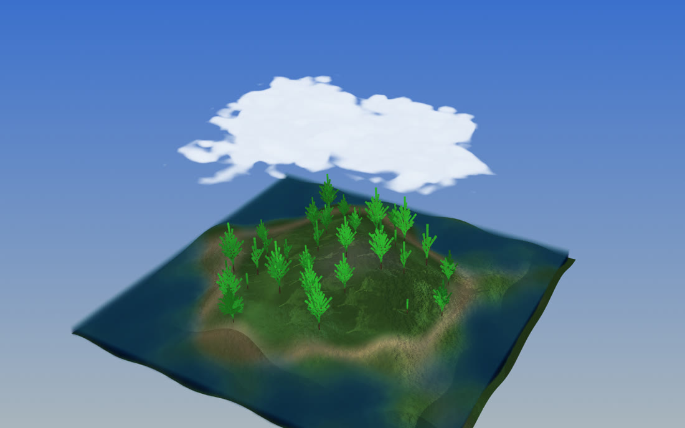

# lsystem_forest — a pure-C++ cvcGL demo

A floating, forested island: an L-system pine forest swaying in the wind on procedural
terrain, a translucent sea volume with cresting waves, a fluffy fractal cloud drifting
overhead and casting a soft shadow on the ground, all under a gradient sky with a
camera-relative sun. It is navigable in real time with a built-in fly/orbit camera, and
it can render a cinematic fly-through or orbit to PNG frames offscreen.

It is a faithful C++ port of the project's Python `lsystem_forest.py` scripting demo, built
entirely on the cvcGL scene graph — no engine, no editor, just `libcvc` + VTK. It doubles
as the worked example for the pieces cvcGL grew to support it: scene-owned lighting and
shadows, in-place volume animation, per-vertex mesh animation, GLSL shader injection, and
the built-in `CameraController`.



---

## Build & run

The example builds with the rest of cvcGL when `-DCVC_BUILD_CVCGL=ON` (it links only
`libcvcGL` + `libcvc`):

```sh
cmake --build build --target lsystem_forest
./build/bin/lsystem_forest                    # interactive window, built-in camera
```

Navigation (see `cvc::gl::CameraController`): `Tab` toggles orbit / Quake-style fly,
`WASD`+mouse flies (the world is Z-up), `Esc` releases the captured pointer. The terminal
prints a live FPS readout.

### Options

| flag | meaning |
|------|---------|
| `--offscreen` | render without opening a window |
| `--no-shadows` | disable the tree shadow map |
| `--frames N` | stop after N frames (0 = until the window closes) |
| `--png FILE` | write the final frame to a PNG after the run |
| `--capture orbit\|fly` | render a cinematic path offscreen to numbered PNGs (forces `--offscreen`) |
| `--out DIR` | output directory for the numbered capture PNGs |
| `--fps F` | capture frames per second — drives the synthetic clock so playback is real-time |
| `--width / --height` | render size in pixels (default 1280×800) |

Render a 12-second fly-through and encode it:

```sh
./build/bin/lsystem_forest --capture fly --frames 360 --fps 30 --width 1280 --height 720 --out /tmp/fly
ffmpeg -framerate 30 -i /tmp/fly/frame_%05d.png -c:v libx264 -pix_fmt yuv420p flythrough.mp4
```

A **capture** is deterministic: it drives a fixed synthetic clock (`t = frame / fps`) and
re-bakes *everything* every frame — wind, swell, cloud drift and both shadows — so the
result plays back smoothly at any offline render speed. The **interactive** loop instead
runs off the wall clock and strides the expensive updates (below) to stay real-time.

---

## How the L-systems work

An [L-system](https://en.wikipedia.org/wiki/L-system) is a string-rewriting grammar
interpreted by a *turtle*: symbols in the string become turtle commands (move, turn,
push/pop a saved pose), and rules rewrite symbols into longer strings, so a short axiom
expands into an intricate, self-similar structure. This demo grows **two** of them — one
for the trees, one for the clouds.

### The trees (`expandTree`, `TREE_RULES`)

The tree turtle carries a 4×4 pose matrix and walks an alphabet:

| symbol | command |
|--------|---------|
| `F` | extrude one tapered branch **segment** forward (+Y, tree-local) and advance |
| `L` | drop a **leaf** (a needle star) at the current pose |
| `R` | **roll** about the branch axis (`YROTATE`, 10°) |
| `T` | **tilt** away from the axis (`TILT`, 120°) |
| `[` `]` | push / pop the pose — a branch point and its return |
| `0`–`4` | recurse: expand `TREE_RULES[digit]` as a child branch, hung off the current pose |

`TREE_RULES[0]` = `FF[RL1][RR2][RRR3]F[RL3][RR1][RRR2]RFLR0` — read it as: grow two
segments, throw three sub-branches (each rolled to a different clock position and expanded
with a *different* rule 1/2/3), grow another segment, throw three more, then continue the
trunk with rule 0. The digits cross-reference the five rules, so branches beget differently
shaped sub-branches; recursion stops when the depth budget runs out.

That depth budget is the tree's **maturity** (`MATURITY[]`, 1–4), chosen at random per
tree — so the forest is the *same* grammar stopped at different depths: saplings to full
pines. Each `expandTree` call emits one **`Module`** (a node in the branch tree) holding
its segments and leaves in a local frame plus a `hang` matrix locating it under its parent;
the whole tree is a vector of modules with parent links. The wind later re-walks exactly
this module tree.

Geometry is generated per module: every `F` segment becomes a `BASE_TRI`-sided tapered
cylinder (`CylTopo`), every `L` a 9-line needle star. Branches at level ≤ `SWAY_LEVELS`
are flagged **swayers** so the wind bends them and not the fine twigs.

### The clouds (`walkClouds`, `CLOUD_AXIOM`, `cloudRule`)

The cloud is grown by a **3-D** turtle into a density field rather than a mesh. Its axiom
`[A][+++++A][-----A]…` fires the rewrite symbol `A` off in several heading directions;
`cloudRule` rewrites each `A`/`B` into a run of `F`s with turns (`+`/`-`), climbs
(`^`/`&`), branches (`[`/`]`) and further `A`/`B`, up to `CLOUD_DEPTH`. Each `F` moves the
turtle and **splats a 3-D Gaussian ball** (`puff` radius) into the voxel grid — additively,
wrapping across the x seam — so overlapping puffs build up a lumpy blob. The field is then
normalised on its 99.9th percentile and faded at all six faces so nothing is cut square.

That L-system blob is only the *shape*. Its surface is then broken up by **fractal Brownian
motion** (`fbm3` over `vhash3`/`vnoise3` — a few octaves of value noise): the fBm is
multiplied in to erode the smooth Gaussian lumps into a cauliflower, cumulus fluff (think
Bob Ross). `buildSky` grows several such fields (`CLOUD_MAPS`); the render **cross-fades**
between them and scrolls the fBm sub-cell every frame, so the cloud slowly boils and drifts
without ever looping visibly.

---

## The render path

Everything hangs off one `SceneGraph` (which owns a `cvc::app` — no global/singleton
context). Nodes are added by name and typed by payload:

```
SceneGraph sg(app, "forest");
sg.addGraphics("terrain", mesh);   // -> GeometryNode  (vtkPolyData + vtkActor)
sg.addGraphics("sea",     volume); // -> VolumeNode    (vtkImageData + vtkSmartVolumeMapper)
```

A `SceneRenderer` binds the scene to a render target (an onscreen window or an offscreen
buffer). Lighting and shadows live on the **scene**, not the renderer, so a second target
(e.g. an offscreen capture) lights and shadows identically.

**Meshes** (`GeometryNode`). The terrain, and one merged wood + one merged needle actor for
the whole forest. The trunks carry a **procedural bark** GLSL shader injected via VTK's
`//VTK::…` shader-replacement hooks (`addBark`): vertical furrows from the bind-pose normal
angle plus fBm, perturbing the normal in the fragment shader. The wind animates vertices in
place through `GeometryNode::updateVertices` (overwrite `vtkPoints` + `Modified`, no
topology rebuild).

**Volumes** (`VolumeNode`). The sea and the cloud are `vtkImageData` scalar fields rendered
by `vtkSmartVolumeMapper` through a color + opacity **transfer function**. The sea is a lit
surface (shading on, a specular sun glint that rides the swell). The cloud is unlit
(`setShading(false)` — VTK's volume gradient-shading would grey a noisy fBm field); its
tops-lit look is baked into the field, and empty sky is pinned exactly transparent so only
dense cores composite.

**Lighting & tree shadows.** Two directional lights (a warm key, a cool fill). Tree shadows
are a `vtkShadowMapBakerPass` + `vtkShadowMapPass` sequence installed on the renderer. That
pass sequence on its own draws *only* the opaque layer — so `SceneGraph::setShadowsEnabled`
appends the rest of VTK's standard order (translucent → volumetric → overlay), or the sea
and cloud would vanish the moment shadows came on. High material ambient on the thin
trunks/line-needles keeps the shadow map's self-shadowing on aliased geometry a gentle
dapple rather than harsh speckle.

**Cloud → ground shadow** (`computeCloudShadow`). The shadow map excludes volumes, so the
cloud can't shadow the ground through it. Instead, for every terrain texel we ray-march the
*same* cloud density field up through the slab, accumulate optical depth τ, and bake
transmittance `exp(-k·τ) × albedo` into the terrain's texture — a directional light pass for
the cloud, computed once per cloud update. It marches a deliberately **steeper pseudo-sun**
than the real 34°-elevation key light: at the true angle the shadow is thrown ~145 units,
clear off the 120-unit island onto the untextured sea; the steeper march lands it on the
island just beneath the cloud, where the eye expects it (a small, honest lie for a legible
shadow).

**Sky & sun.** The background is a vertical **gradient** (not a sky sphere — a sphere would
occlude the shadow light). The sun is a flat-lit disc + halo placed as a **camera-relative
billboard at infinity** in the key-light direction, depth-capped so it never stretches the
shadow map's depth range and self-shadows the island.

**Sea surface** (`seaSurface`). Four incommensurate travelling waves, each crested by
raising `sin` to a power, summed at low amplitude — an erratic, non-sinusoidal swell rather
than one obvious sine.

---

## Realtime performance

The interactive loop targets ≥30 fps at 1280×800 with shadows on. Two fixed per-frame costs
dominated the naive version (~8 fps) — neither pixel-bound, so lowering the resolution
barely helped:

1. **Per-frame volume re-import.** Animating a volume by rebuilding it (`setVolume`) each
   frame reallocates the image, rescans the scalar range, resets the transfer function and
   logs heavily. `VolumeNode::updateScalars` overwrites the voxels in place (memcpy +
   `Modified`) and leaves the range/TF alone — orders of magnitude cheaper. The sea and
   cloud fields keep a stable range frame-to-frame, so this is safe; it is the reusable
   primitive per-frame volume animation always wanted.

2. **Per-actor forest overhead.** The forest was 32 trees × 2 actors = 64 actors, each
   re-posed by the wind with its own vertex upload and drawn separately in *both* the main
   pass and the shadow bake. Merging the whole forest into **one wood + one needle actor**
   (route C across trees) collapses 64 uploads/draws to 2. This was the single biggest win
   (≈17 → 29 fps on its own).

On top of that the interactive loop **decouples update cadences** — the wind and sea refresh
every 2nd/4th frame, the drifting cloud every 8th, its ground shadow every 16th — because
each moves at a different speed and a gentle sway is imperceptibly stepped. Captures ignore
all of this and refresh every frame.

Net: **~36 fps** at 1280×800 with shadows and full quality. Note a hard ceiling: two GPU
ray-cast volumes cost ~30 fps to draw *even with zero animation*, so 60 fps is not reachable
for this scene without dropping a volume.

---

## Code map

All in `lsystem_forest.cpp` (top to bottom):

| region | what |
|--------|------|
| `Mat4`, `mRot`/`mMul`/`xform` | tiny 4×4 matrix / turtle math |
| `TREE_RULES`, `expandTree`, `Module` | the tree L-system → a module tree |
| `CylTopo`, `buildTree`, `flattenPoints` | tree geometry, merged into the shared forest meshes |
| `BARK_GLSL`, `addBark` | injected procedural-bark shader |
| `buildTerrain`, `terrainH`, `terrainAlbedo`, `addTerrainBump` | procedural island |
| `seaSurface`, `seaField`, `seaVolume`, `seaTransfer` | the cresting-wave sea volume |
| `CLOUD_AXIOM`, `cloudRule`, `walkClouds`, `fbm3`, `SkyModel`, `buildSky` | the cloud L-system + fBm + crossfade |
| `computeCloudShadow`, `sampleSky` | cloud → ground shadow bake |
| sun disc / halo / `placeSky` | camera-relative sun billboard + gradient sky |
| `reposeTree` | the per-frame wind cascade into the merged buffers |
| `main` | scene assembly, capture paths, and the interactive frame loop |
